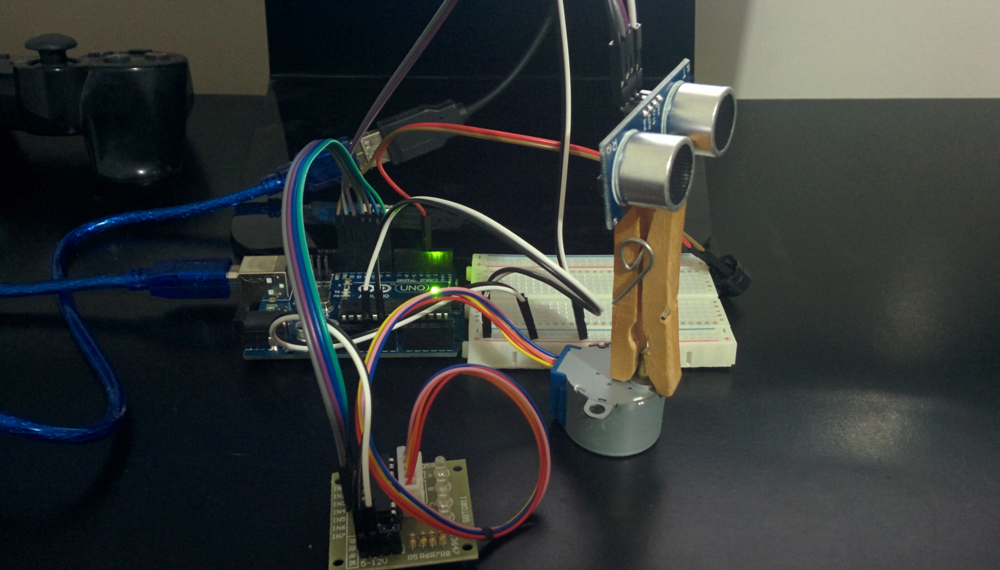

## Synopsis

 * Sonar-V for Arduino
 
 
 Uses a Stepper and an Ultrasonic range finder to scan an arc for moving objects.

## Hardware

 * 1- Arduino (UNO R3)
 * 2- Steeper (28BYJ-48 - Pins IN1:8, IN2:10, IN3:9, IN4:11 - 5V)
 * 3- Ultrasonic range finder (HC-SRD4 - Pins E:12, T:13 - 5V)
 * 4- Buzzer (Pin 3)

## Contributors

Developer: Allan Brazute @ SpotApp

## License

ISC